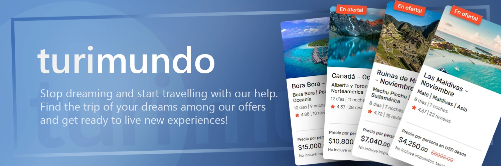
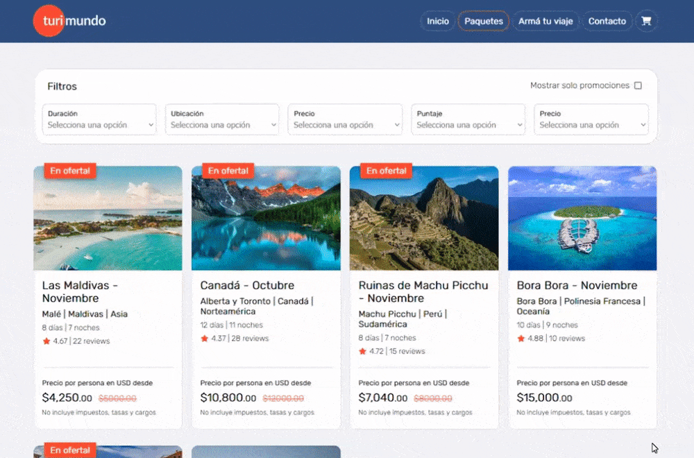
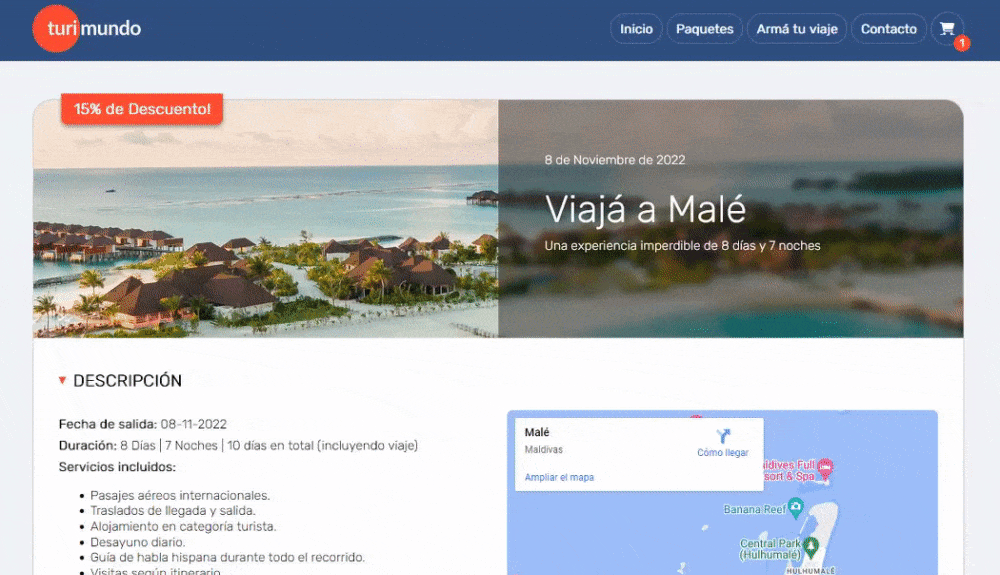

 

This simple project is an exercise of the introductory course to JavaScript provided by <a href="https://www.buenosaires.gob.ar/educacion/codo-codo" target="_blank">"Codo a Codo 4.0"</a>. The data used for this exercise was partially created from scratch and taken from reference pages like <a href="https://becciu-sintectur.com.ar/viajes-grupales/detalle/francia/" target="_blank">Sintec Tur</a>. The web design and page layout is based on the design of the <a href="https://almundo.com.ar/paquetes-turisticos" target="_blank">Al Mundo</a> y <a href="https://becciu-sintectur.com.ar/" target="_blank">Sintec Tur</a> websites.

The purpose of the exercise was to encompass all basics concepts approached by the course: page structure and semantic HTML, CSS & responsive web design, page/component behavior and DOM manipulation with JS, among others concepts.

 

<h1>Key Features.</h1>

This site its just a mock of a real e-commerce and it lacks the functionality usually associated with this kind of sites. The purpouse of this project is to showcase the behavior of its various pages and components (responsive design, animations, dynamic rendering, etc.).

<ul>
  <li>Navigate through the list of packs and offers, and filter them out to find the one you looking for.</li>
  <li>Find information details about the pack you are interested in.</li>
  <li>Add the pack to the cart...</li>
  <li>Checkout!</li>
</ul>

 
<h2>Navigate</h2>

The data is stored locally in the project and contains all the information needed about each pack. Each card shows the name and basic info of each pack and can be filtered out to speed up the searching process. Click on the "card" and gain access to the detail page associated with the pack.

 
<h2>Display details</h2>

In the detail page you will find a wide array of information including price detail, google maps integration, detailed itinerary, etc. Each pack page is generated dynamically making use of the "id" query parameter.

 
<h2>Add to Cart and Checkout!</h2>

Once you added the pack into the cart you can proceed to the checkout page, there you can remove the pack from the shoping cart, go back to the details page, or finish the purchase. The cart stores all its items in the localStorage, and deletes them once the "purchase" is finished.

 
 
<h2>Credits</h2>
<ul>
  <li>Special thanks to <a href="https://github.com/naisheffield" target="_blank">Naiara Sheffield</a> and <a href="https://github.com/brendaborrego" target="_blank">Brenda Borrego</a>, which whom I shared the "Codo a Codo" experience.
  <li>You can visit <a href="https://www.buenosaires.gob.ar/educacion/codo-codo" target="_blank">Codo a Codo</a> page to access list of courses.</li>
  <li>The original version of this project can be found <a href="https://github.com/naisheffield/Proyecto-Full-Stack-Python-2022/tree/main" target="_blank">here</a>.</li>
</ul>

